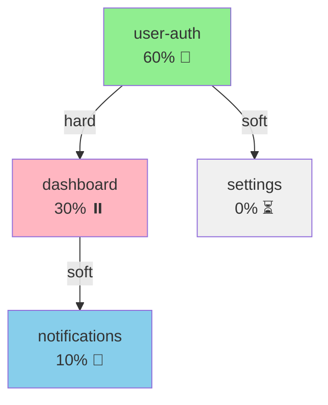

# Feature Dependency Management

Manage dependencies between parallel features.

---

## Overview

Dependency management ensures:
- Clear dependency relationships
- Correct development order
- Blocker identification
- Efficient resource allocation

---

## Dependency Types

### 1. Hard Dependencies

Feature cannot proceed without dependency completion.

```yaml
hard_dependency:
  feature: "feature-dashboard"
  depends_on: "feature-user-auth"
  type: "hard"
  reason: "Dashboard requires auth API for user data"
  required_phase: "implementation_complete"
  blocks_at_phase: "implementation"
```

### 2. Soft Dependencies

Feature can proceed but will need integration later.

```yaml
soft_dependency:
  feature: "feature-notifications"
  depends_on: "feature-dashboard"
  type: "soft"
  reason: "Notifications will integrate with dashboard"
  integration_phase: "testing"
  can_parallel: true
```

### 3. Shared Resource Dependencies

Features share common code or resources.

```yaml
shared_resource:
  resource: "src/lib/api.ts"
  features:
    - "feature-user-auth"
    - "feature-dashboard"
  conflict_risk: "medium"
  coordination: "required"
```

---

## Dependency Declaration

### In Feature Status

```json
// feature-dashboard/dependencies.json
{
  "feature_id": "feature-dashboard",

  "depends_on": [
    {
      "feature": "feature-user-auth",
      "type": "hard",
      "reason": "Requires auth context and user API",
      "required_phase": "implementation",
      "status": "waiting",
      "blocking_since": "2024-01-13T10:00:00Z"
    }
  ],

  "blocks": [
    {
      "feature": "feature-notifications",
      "type": "soft",
      "reason": "Notifications will use dashboard components",
      "unblock_at_phase": "implementation"
    }
  ],

  "shared_resources": [
    {
      "path": "src/lib/api.ts",
      "shared_with": ["feature-user-auth"],
      "sections_affected": ["interceptors", "error handling"],
      "coordination_status": "aligned"
    }
  ]
}
```

---

## Dependency Graph

### Visual Representation

```
┌─────────────────────────────────────────────────────────────┐
│                    Feature Dependency Graph                  │
├─────────────────────────────────────────────────────────────┤
│                                                             │
│  ┌──────────────┐                                          │
│  │  user-auth   │ ← No dependencies (can start)           │
│  │   [60%] 🔄   │                                          │
│  └──────┬───────┘                                          │
│         │                                                   │
│         │ hard                                              │
│         ▼                                                   │
│  ┌──────────────┐                                          │
│  │  dashboard   │ ← Blocked by user-auth                   │
│  │   [30%] ⏸️   │                                          │
│  └──────┬───────┘                                          │
│         │                                                   │
│         │ soft                                              │
│         ▼                                                   │
│  ┌──────────────┐                                          │
│  │notifications │ ← Can proceed, integrate later           │
│  │   [10%] 🔄   │                                          │
│  └──────────────┘                                          │
│                                                             │
│  Legend:                                                    │
│  ─── hard dependency (blocks)                              │
│  ··· soft dependency (integration needed)                  │
│  🔄 in progress  ⏸️ blocked  ✅ complete                   │
│                                                             │
└─────────────────────────────────────────────────────────────┘
```

### Mermaid Diagram



---

## Dependency Resolution

### Resolution Strategies

```yaml
resolution_strategies:
  hard_dependency_blocked:
    actions:
      - "Notify blocking feature owner"
      - "Add to blocker dashboard"
      - "Track waiting time"
      - "Escalate if >24 hours"

  soft_dependency:
    actions:
      - "Allow parallel development"
      - "Schedule integration checkpoint"
      - "Create integration task"

  shared_resource_conflict:
    actions:
      - "Identify overlapping sections"
      - "Coordinate changes"
      - "Merge more frequently"
      - "Consider feature branches from feature branches"
```

### Unblocking Process

```typescript
// Unblock dependent features when dependency completes
async function onPhaseComplete(featureId: string, phase: string) {
  const blockedFeatures = await getBlockedBy(featureId);

  for (const blocked of blockedFeatures) {
    const dep = blocked.dependencies.find(d => d.feature === featureId);

    if (dep.required_phase === phase) {
      // Unblock the feature
      await unblockFeature(blocked.id, {
        unblocked_by: featureId,
        unblocked_at: new Date().toISOString(),
      });

      // Notify team
      await notify({
        type: 'feature_unblocked',
        feature: blocked.name,
        unblocked_by: featureId,
      });
    }
  }
}
```

---

## Circular Dependency Detection

```typescript
// Detect circular dependencies
function detectCircularDependencies(features: Feature[]): Cycle[] {
  const cycles: Cycle[] = [];
  const visited = new Set<string>();
  const recursionStack = new Set<string>();

  function dfs(featureId: string, path: string[]): boolean {
    visited.add(featureId);
    recursionStack.add(featureId);

    const feature = features.find(f => f.id === featureId);
    if (!feature) return false;

    for (const dep of feature.depends_on) {
      if (!visited.has(dep.feature)) {
        if (dfs(dep.feature, [...path, featureId])) {
          return true;
        }
      } else if (recursionStack.has(dep.feature)) {
        // Cycle detected
        cycles.push({
          path: [...path, featureId, dep.feature],
          severity: 'error',
        });
        return true;
      }
    }

    recursionStack.delete(featureId);
    return false;
  }

  for (const feature of features) {
    if (!visited.has(feature.id)) {
      dfs(feature.id, []);
    }
  }

  return cycles;
}
```

**Alert on Circular Dependency:**
```
⛔ CIRCULAR DEPENDENCY DETECTED

Path: user-auth → dashboard → user-settings → user-auth

This creates a deadlock where no feature can proceed.

Resolution Options:
1. Remove one of the dependencies
2. Break feature into smaller parts
3. Extract shared functionality to separate feature
```

---

## Dependency Impact Analysis

```yaml
impact_analysis:
  feature: "feature-user-auth"

  if_delayed:
    directly_blocked:
      - "feature-dashboard"
      - "feature-settings"
    indirectly_affected:
      - "feature-notifications"
    total_impact_days: 5

  if_scope_changes:
    api_changes_affect:
      - "feature-dashboard": "API integration"
      - "feature-settings": "Auth context usage"
    notification_required: true

  completion_enables:
    immediate:
      - "feature-dashboard can proceed"
    subsequent:
      - "feature-notifications integration"
```

---

## Coordination Workflow

### Daily Dependency Check

```yaml
daily_check:
  time: "09:00"
  actions:
    - "Check all blocked features"
    - "Update dependency status"
    - "Identify new blockers"
    - "Generate coordination report"
    - "Notify relevant teams"
```

### Coordination Report

```markdown
# Daily Dependency Report - 2024-01-15

## Blocked Features: 2

### feature-dashboard
- **Blocked by:** feature-user-auth
- **Waiting since:** 2 days
- **Expected unblock:** Today (user-auth at 60%)
- **Action:** Monitor user-auth progress

### feature-reports
- **Blocked by:** feature-dashboard
- **Waiting since:** 2 days
- **Expected unblock:** 3 days (cascading)
- **Action:** Consider parallel design work

## Unblocked Today: 1

### feature-settings
- **Was blocked by:** feature-user-auth
- **Unblocked at:** 09:30
- **Action:** Resume implementation

## Upcoming Dependencies

| Feature | Depends On | Expected Resolution |
|---------|------------|---------------------|
| notifications | dashboard | 5 days |
| analytics | user-auth | 1 day |
```

---

## Configuration

```yaml
# proagents.config.yaml

dependencies:
  enabled: true

  detection:
    circular: true
    alert_on_circular: true

  blocking:
    max_wait_time: "48h"
    escalate_after: "24h"

  coordination:
    daily_check: true
    check_time: "09:00"
    report_channel: "slack"

  visualization:
    generate_graph: true
    format: "mermaid"
```

---

## Commands

| Command | Description |
|---------|-------------|
| `pa:deps` | View dependency graph |
| `pa:deps [feature]` | View feature dependencies |
| `pa:deps --blocked` | List blocked features |
| `pa:deps --add [from] [to]` | Add dependency |
| `pa:deps --remove [from] [to]` | Remove dependency |
| `pa:deps --check` | Check for issues |
