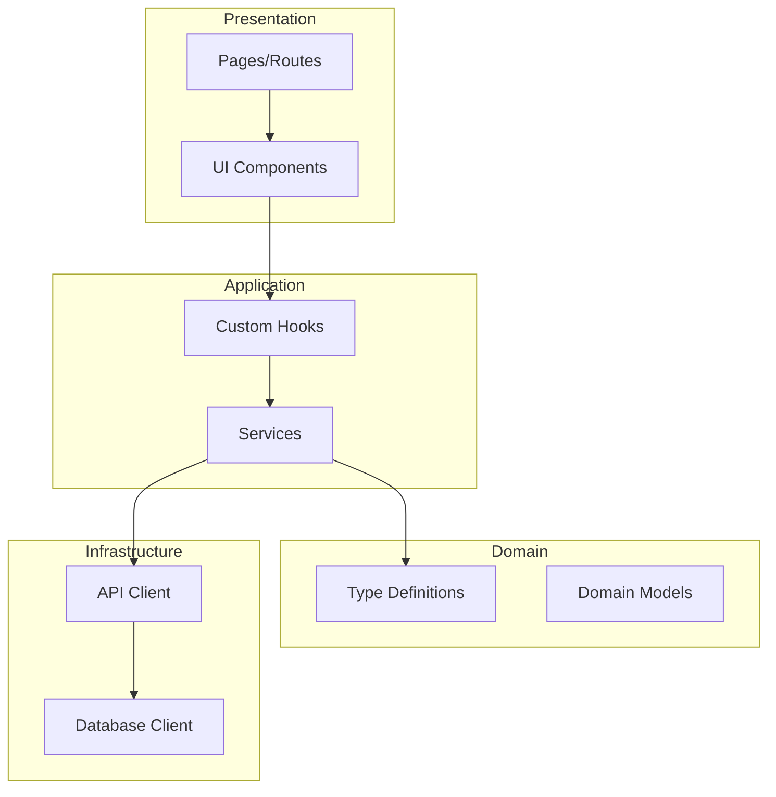
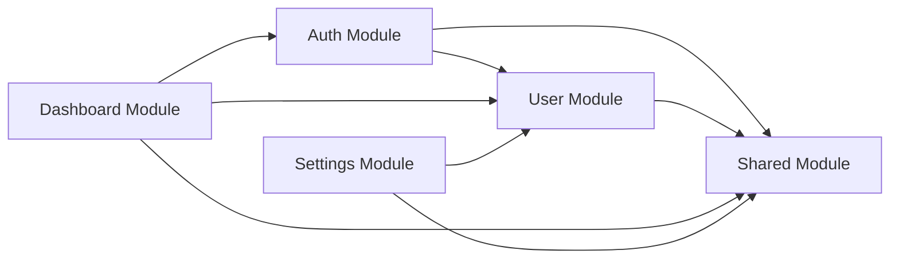

# Architecture Extraction

Extract and document system architecture from existing code.

---

## What Gets Extracted

### 1. High-Level Architecture

```yaml
architecture:
  type: "monolith"  # monolith | microservices | serverless | hybrid
  style: "layered"  # layered | clean | hexagonal | mvc | feature-based

  layers:
    - name: "Presentation"
      path: "src/components/, src/pages/"
      responsibility: "UI rendering and user interaction"

    - name: "Application"
      path: "src/services/, src/hooks/"
      responsibility: "Business logic and orchestration"

    - name: "Domain"
      path: "src/models/, src/types/"
      responsibility: "Core business entities and rules"

    - name: "Infrastructure"
      path: "src/api/, src/database/"
      responsibility: "External service integration"
```

### 2. Module Structure

```yaml
modules:
  - name: "Authentication"
    path: "src/modules/auth/"
    type: "feature-module"
    components:
      - "LoginForm"
      - "RegisterForm"
      - "AuthProvider"
    services:
      - "authService"
      - "tokenService"
    dependencies:
      internal: ["user", "api"]
      external: ["axios", "jwt-decode"]

  - name: "Dashboard"
    path: "src/modules/dashboard/"
    type: "feature-module"
    components:
      - "DashboardPage"
      - "StatsWidget"
      - "ActivityFeed"
    dependencies:
      internal: ["auth", "api", "user"]
```

### 3. Entry Points

```yaml
entry_points:
  web:
    - path: "src/main.tsx"
      type: "spa_entry"
      framework: "react"

  api:
    - path: "src/server.ts"
      type: "api_server"
      framework: "express"
      port: 3000

  workers:
    - path: "src/workers/queue.ts"
      type: "background_worker"
      purpose: "Job processing"
```

---

## Extraction Process

### Step 1: Project Scanning

```
Scanning project structure...

Detected:
├── Framework: React 18 + Next.js 14
├── Language: TypeScript
├── Styling: Tailwind CSS
├── State: Zustand + React Query
├── Database: PostgreSQL + Prisma
├── Auth: NextAuth.js
└── Testing: Jest + Testing Library
```

### Step 2: Architecture Pattern Detection

```
Analyzing code organization...

Pattern Detected: Feature-Based Architecture

Evidence:
- src/features/ directory exists
- Each feature has components/, hooks/, services/
- Shared code in src/shared/
- Clear module boundaries

Confidence: 92%
```

### Step 3: Layer Identification

```
Identifying architectural layers...

Layers Found:
┌─────────────────────────────────────────┐
│ Presentation Layer                       │
│ └─ src/components/, src/pages/          │
├─────────────────────────────────────────┤
│ Application Layer                        │
│ └─ src/features/*/hooks/                │
│ └─ src/features/*/services/             │
├─────────────────────────────────────────┤
│ Domain Layer                             │
│ └─ src/types/, src/models/              │
├─────────────────────────────────────────┤
│ Infrastructure Layer                     │
│ └─ src/lib/, src/api/                   │
│ └─ prisma/                              │
└─────────────────────────────────────────┘
```

### Step 4: Boundary Analysis

```
Analyzing module boundaries...

Module Boundaries:
┌──────────────┐    ┌──────────────┐    ┌──────────────┐
│     Auth     │───▶│     User     │───▶│   Profile    │
└──────────────┘    └──────────────┘    └──────────────┘
       │                   │                   │
       ▼                   ▼                   ▼
┌──────────────────────────────────────────────────────┐
│                    Shared/Common                      │
│  (API client, utilities, types, UI components)       │
└──────────────────────────────────────────────────────┘
```

---

## Output Format

### Architecture Document

```markdown
# System Architecture

## Overview
This is a [monolithic/microservices] application built with [framework].
It follows a [pattern] architecture pattern.

## High-Level Architecture

```
┌─────────────────────────────────────────────────────┐
│                    Client (Browser)                  │
└─────────────────────────────────────────────────────┘
                         │
                         ▼
┌─────────────────────────────────────────────────────┐
│              Next.js Application                     │
│  ┌─────────────┐  ┌─────────────┐  ┌─────────────┐ │
│  │   Pages     │  │   API       │  │  Components │ │
│  │   (SSR)     │  │   Routes    │  │             │ │
│  └─────────────┘  └─────────────┘  └─────────────┘ │
└─────────────────────────────────────────────────────┘
                         │
                         ▼
┌─────────────────────────────────────────────────────┐
│                    Database                          │
│                   (PostgreSQL)                       │
└─────────────────────────────────────────────────────┘
```

## Modules

### Authentication Module
- **Purpose:** Handle user authentication and authorization
- **Location:** `src/features/auth/`
- **Key Components:** LoginForm, AuthProvider, useAuth
- **Dependencies:** User module, API client

### User Module
- **Purpose:** Manage user data and profiles
- **Location:** `src/features/user/`
- **Key Components:** UserProfile, UserSettings
- **Dependencies:** Auth module, API client

## Data Flow

1. User interacts with UI component
2. Component calls custom hook
3. Hook uses service/API client
4. API route handles request
5. Database query via Prisma
6. Response flows back up

## Key Decisions

| Decision | Choice | Rationale |
|----------|--------|-----------|
| Framework | Next.js | SSR + API routes |
| State | Zustand | Simple, lightweight |
| Database | PostgreSQL | Relational data needs |
| ORM | Prisma | Type safety, migrations |
```

---

## Architecture Diagram Generation

### Component Diagram



### Module Dependency Diagram



---

## Configuration

```yaml
# proagents.config.yaml

reverse_engineering:
  architecture:
    enabled: true

    detect:
      - architecture_pattern
      - module_boundaries
      - layer_structure
      - entry_points
      - integration_points

    output:
      format: "markdown"
      diagrams: true
      diagram_format: "mermaid"  # mermaid | plantuml | ascii

    depth:
      full: true  # Analyze entire codebase
      # OR
      paths:      # Analyze specific paths
        - "src/"
        - "lib/"
```

---

## Commands

| Command | Description |
|---------|-------------|
| `pa:re-architecture` | Full architecture extraction |
| `pa:re-architecture --diagram` | Generate architecture diagrams |
| `pa:re-architecture --modules` | Extract module structure |
| `pa:re-architecture --layers` | Identify layers |
| `pa:re-architecture --boundaries` | Analyze boundaries |
