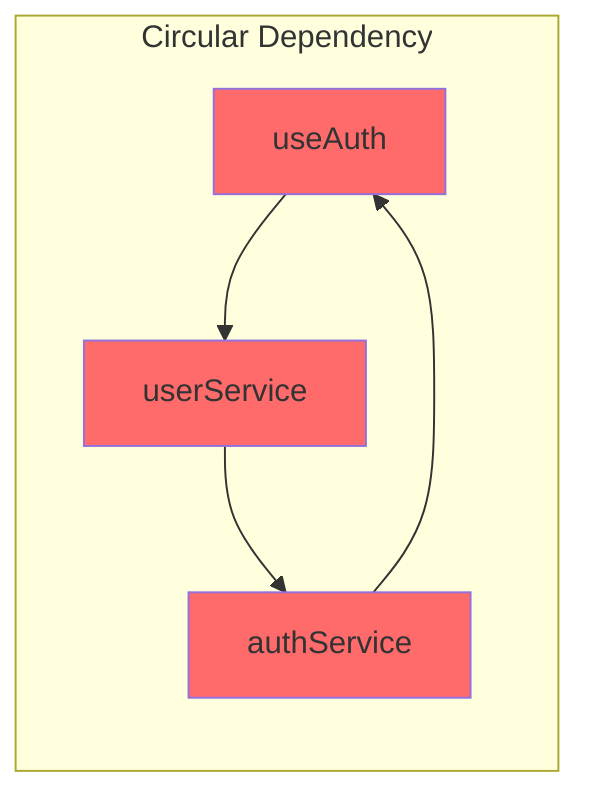

# Dependency Mapping

Map and visualize all dependencies in a codebase - internal modules, external packages, and their relationships.

---

## Overview

Dependency mapping provides:
- Clear understanding of code relationships
- Impact analysis for changes
- Circular dependency detection
- Dead code identification
- Upgrade planning for packages

---

## Mapping Types

### 1. Internal Module Dependencies

```yaml
internal_dependencies:
  module: "src/features/auth"

  imports_from:
    internal:
      - module: "src/lib/api"
        imports: ["api", "ApiError"]
        usage: "API calls"

      - module: "src/stores/authStore"
        imports: ["useAuthStore"]
        usage: "State management"

      - module: "src/types/auth"
        imports: ["User", "AuthResponse", "LoginInput"]
        usage: "Type definitions"

    shared:
      - module: "src/components/ui"
        imports: ["Button", "Input", "Card"]
        usage: "UI components"

      - module: "src/hooks/useToast"
        imports: ["useToast"]
        usage: "Notifications"

  exported_to:
    - module: "src/pages/login"
      exports: ["LoginForm", "useAuth"]

    - module: "src/features/dashboard"
      exports: ["useAuth", "AuthProvider"]

    - module: "src/app/layout"
      exports: ["AuthProvider"]
```

**Dependency Graph:**
```
┌─────────────────────────────────────────────────────────────┐
│                      auth module                             │
├─────────────────────────────────────────────────────────────┤
│                                                             │
│  Imports From:                    Exports To:               │
│  ─────────────                    ───────────               │
│  ┌─────────┐                      ┌─────────┐               │
│  │ api     │──────┐    ┌─────────▶│ login   │               │
│  └─────────┘      │    │          │ page    │               │
│                   │    │          └─────────┘               │
│  ┌─────────┐      │    │                                    │
│  │authStore│──────┼────┼─────────▶┌─────────┐               │
│  └─────────┘      │    │          │dashboard│               │
│                   ▼    │          └─────────┘               │
│  ┌─────────┐   ┌──────────┐                                 │
│  │ types   │──▶│   AUTH   │──────▶┌─────────┐               │
│  └─────────┘   │  MODULE  │       │ layout  │               │
│                └──────────┘       └─────────┘               │
│  ┌─────────┐      ▲                                         │
│  │   ui    │──────┤                                         │
│  └─────────┘      │                                         │
│                   │                                         │
│  ┌─────────┐      │                                         │
│  │useToast │──────┘                                         │
│  └─────────┘                                                │
│                                                             │
└─────────────────────────────────────────────────────────────┘
```

---

### 2. External Package Dependencies

```yaml
external_dependencies:
  production:
    core:
      - name: "react"
        version: "18.2.0"
        imported_by: 128 files
        usage: "Core framework"

      - name: "next"
        version: "14.0.0"
        imported_by: 45 files
        usage: "Framework"

    state:
      - name: "zustand"
        version: "4.4.0"
        imported_by: 12 files
        usage: "Global state"

      - name: "@tanstack/react-query"
        version: "5.0.0"
        imported_by: 34 files
        usage: "Server state"

    ui:
      - name: "tailwindcss"
        version: "3.4.0"
        imported_by: "CSS config"
        usage: "Styling"

      - name: "class-variance-authority"
        version: "0.7.0"
        imported_by: 25 files
        usage: "Component variants"

    utilities:
      - name: "date-fns"
        version: "3.0.0"
        imported_by: 15 files
        functions_used: ["format", "parseISO", "isAfter"]

      - name: "lodash-es"
        version: "4.17.21"
        imported_by: 8 files
        functions_used: ["debounce", "throttle", "groupBy"]

  development:
    - name: "typescript"
      version: "5.3.0"

    - name: "vitest"
      version: "1.0.0"

    - name: "eslint"
      version: "8.56.0"

    - name: "@types/node"
      version: "20.10.0"
```

---

### 3. Dependency Tree

```yaml
dependency_tree:
  react:
    version: "18.2.0"
    dependencies:
      - "loose-envify@1.4.0"
      - "scheduler@0.23.0"

  next:
    version: "14.0.0"
    dependencies:
      - "react@18.2.0" (peer)
      - "react-dom@18.2.0" (peer)
      - "@next/env@14.0.0"
      - "@swc/helpers@0.5.0"
      - "postcss@8.4.31"
      # ... more

  "@tanstack/react-query":
    version: "5.0.0"
    dependencies:
      - "@tanstack/query-core@5.0.0"
      - "react@18.2.0" (peer)

  total_packages: 856
  direct_dependencies: 45
  transitive_dependencies: 811
```

---

### 4. Import Analysis

```yaml
import_analysis:
  most_imported_internal:
    - module: "@/lib/utils"
      imports: 89
      exports_used: ["cn", "formatDate", "generateId"]

    - module: "@/components/ui/button"
      imports: 67
      exports_used: ["Button", "buttonVariants"]

    - module: "@/hooks/useAuth"
      imports: 45
      exports_used: ["useAuth", "AuthProvider"]

    - module: "@/types"
      imports: 42
      exports_used: ["User", "Post", "ApiResponse"]

  most_imported_external:
    - package: "react"
      imports: 128
      exports_used: ["useState", "useEffect", "useCallback", "memo"]

    - package: "next/navigation"
      imports: 34
      exports_used: ["useRouter", "useSearchParams", "redirect"]

    - package: "@tanstack/react-query"
      imports: 34
      exports_used: ["useQuery", "useMutation", "QueryClient"]

  import_patterns:
    barrel_exports: true
    path_aliases: ["@/*"]
    absolute_imports: true
```

---

### 5. Circular Dependency Detection

```yaml
circular_dependencies:
  found: 3
  severity: "warning"

  cycles:
    - cycle: 1
      severity: "high"
      path:
        - "src/features/auth/hooks/useAuth.ts"
        - "src/features/user/services/userService.ts"
        - "src/features/auth/services/authService.ts"
        - "src/features/auth/hooks/useAuth.ts"
      resolution: |
        Extract shared types to src/types/auth.ts
        Use dependency injection in services

    - cycle: 2
      severity: "medium"
      path:
        - "src/components/Modal.tsx"
        - "src/components/Form.tsx"
        - "src/components/Modal.tsx"
      resolution: |
        Create separate ModalForm component
        Or pass Form as children to Modal

    - cycle: 3
      severity: "low"
      path:
        - "src/utils/format.ts"
        - "src/utils/validate.ts"
        - "src/utils/format.ts"
      resolution: |
        Move shared helpers to src/utils/helpers.ts
```

**Visualization:**


---

### 6. Dead Code Detection

```yaml
dead_code:
  unused_exports:
    - file: "src/utils/legacy.ts"
      exports:
        - "formatCurrency"  # Never imported
        - "parseDateOld"    # Never imported
      recommendation: "Remove or mark as deprecated"

    - file: "src/components/OldButton.tsx"
      exports:
        - "OldButton"
      recommendation: "Remove - replaced by new Button"

  unused_files:
    - "src/utils/deprecated.ts"
    - "src/components/legacy/Card.tsx"
    - "src/hooks/useOldAuth.ts"

  unused_dependencies:
    - package: "moment"
      installed: true
      imported: false
      recommendation: "Remove from package.json"

    - package: "lodash"
      installed: true
      imported: false
      note: "lodash-es is used instead"

  potentially_dead:
    - file: "src/services/analyticsService.ts"
      reason: "Only imported in commented-out code"
      confidence: 0.85
```

---

### 7. Impact Analysis

```yaml
impact_analysis:
  file: "src/lib/api.ts"

  direct_dependents: 24
  indirect_dependents: 86
  total_affected: 110

  dependents_by_type:
    services: 18
    hooks: 12
    components: 56
    pages: 24

  breaking_change_impact:
    if_removed:
      - "All API calls will fail"
      - "86 components affected"
      - "Critical severity"

    if_signature_changed:
      files_to_update: 24
      estimated_effort: "2-4 hours"

  dependency_chain:
    api.ts:
      - authService.ts:
          - useAuth.ts:
              - LoginPage.tsx
              - DashboardLayout.tsx
              - ProtectedRoute.tsx
          - AuthProvider.tsx:
              - App.tsx
      - userService.ts:
          - useUser.ts:
              - ProfilePage.tsx
              - SettingsPage.tsx
```

---

### 8. Package Health Analysis

```yaml
package_health:
  outdated:
    - package: "axios"
      current: "1.3.0"
      latest: "1.6.0"
      update_type: "minor"
      breaking_changes: false

    - package: "react-hook-form"
      current: "7.40.0"
      latest: "7.48.0"
      update_type: "minor"
      breaking_changes: false

    - package: "zod"
      current: "3.20.0"
      latest: "3.22.0"
      update_type: "minor"
      breaking_changes: false

  security_vulnerabilities:
    critical: 0
    high: 0
    moderate: 1
    low: 2
    details:
      - package: "semver"
        severity: "moderate"
        vulnerability: "ReDoS"
        fix: "Upgrade to 7.5.4"
        path: "npm > semver"

  deprecated:
    - package: "request"
      alternative: "Use axios or fetch"
      used_by: "Old migration script"

  license_issues:
    - package: "gpl-package"
      license: "GPL-3.0"
      issue: "Incompatible with MIT"
      action: "Review usage"
```

---

## Dependency Report

```markdown
# Dependency Analysis Report

## Project: MyApp
## Analyzed: 2024-01-15

---

## Summary

| Category | Count |
|----------|-------|
| Direct Dependencies | 45 |
| Dev Dependencies | 28 |
| Total Packages | 856 |
| Internal Modules | 34 |
| Circular Dependencies | 3 |
| Unused Packages | 2 |
| Security Issues | 1 |

---

## Internal Module Map

### Most Coupled Modules
| Module | Imports | Exports To | Coupling Score |
|--------|---------|------------|----------------|
| @/lib/api | 5 | 24 | High |
| @/hooks/useAuth | 8 | 45 | High |
| @/components/ui | 2 | 67 | Medium |
| @/types | 0 | 42 | Low (Good) |

### Module Boundaries
- Well-defined: auth, dashboard, settings
- Needs work: utils (too many responsibilities)
- Good isolation: types, constants

---

## External Package Analysis

### Critical Dependencies
| Package | Imported By | Risk if Removed |
|---------|-------------|-----------------|
| react | 128 files | Total failure |
| next | 45 files | Total failure |
| zustand | 12 files | State management failure |
| axios | 24 files | API failure |

### Bundle Size Impact
| Package | Size | Tree-shakeable |
|---------|------|----------------|
| lodash-es | 25KB | Yes |
| date-fns | 18KB | Yes |
| axios | 14KB | No |
| zod | 12KB | Yes |

---

## Issues Found

### Critical
- None

### Warning
1. 3 circular dependencies detected
2. 1 moderate security vulnerability (semver)

### Info
1. 2 unused packages can be removed
2. 5 packages have updates available

---

## Recommendations

1. **Remove unused packages:**
   ```bash
   npm uninstall moment lodash
   ```

2. **Fix circular dependencies:**
   - See circular_dependencies section for resolution

3. **Update packages:**
   ```bash
   npm update axios react-hook-form zod
   ```

4. **Fix security issue:**
   ```bash
   npm audit fix
   ```
```

---

## Configuration

```yaml
# proagents.config.yaml

reverse_engineering:
  dependency_mapping:
    enabled: true

    analyze:
      - internal_modules
      - external_packages
      - circular_dependencies
      - dead_code
      - package_health

    report:
      format: "markdown"
      include_visualizations: true
      include_recommendations: true

    thresholds:
      max_coupling_score: 10
      max_circular_deps: 0
      security_block_on: ["critical", "high"]

    ignore:
      packages:
        - "dev-only-tool"
      paths:
        - "scripts/"
        - "__tests__/"
```

---

## Slash Commands

| Command | Description |
|---------|-------------|
| `pa:re-deps` | Full dependency analysis |
| `pa:re-deps --internal` | Internal modules only |
| `pa:re-deps --external` | External packages only |
| `pa:re-deps --circular` | Find circular dependencies |
| `pa:re-deps --dead` | Find dead/unused code |
| `pa:re-deps --security` | Security vulnerability check |
| `pa:re-deps --impact [file]` | Impact analysis for file |
| `pa:re-deps --outdated` | List outdated packages |
| `pa:re-deps --tree` | Show dependency tree |
