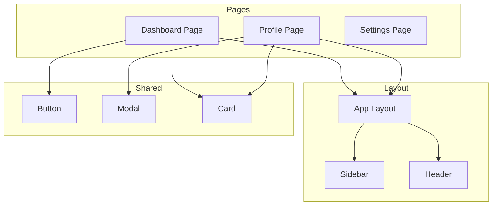
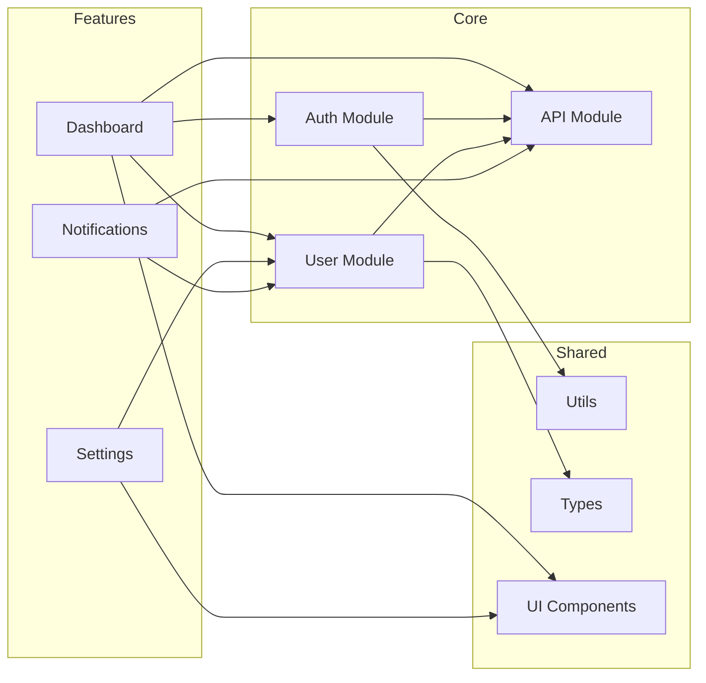
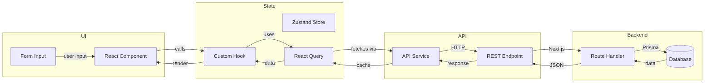
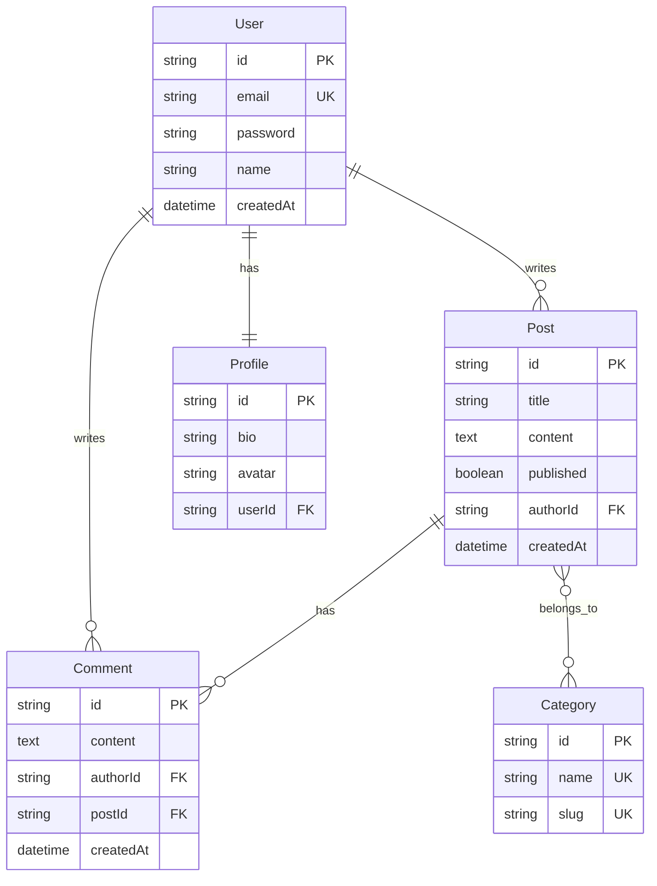
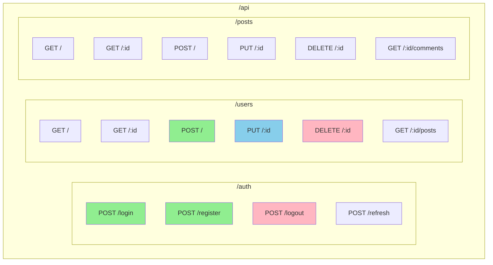
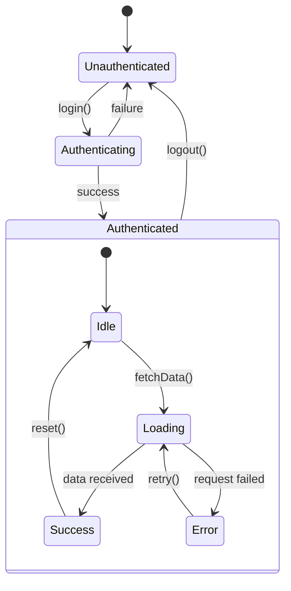
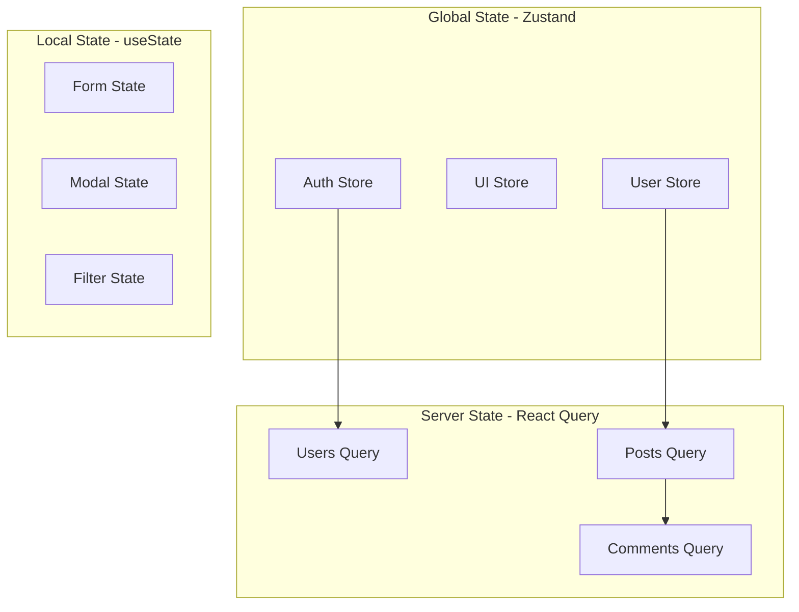
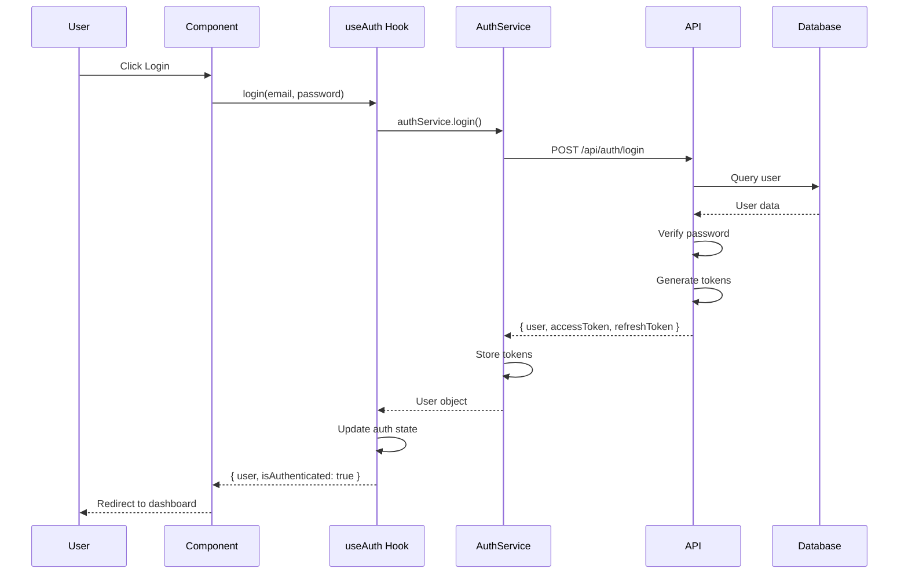
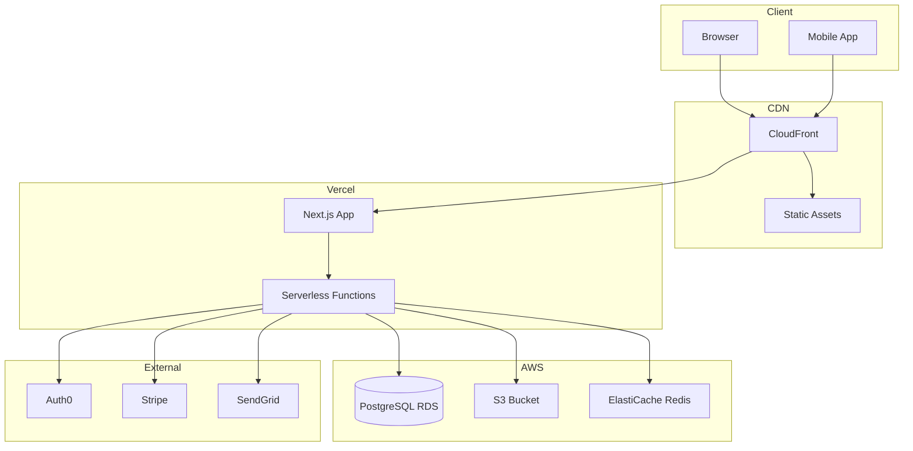
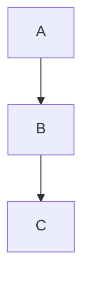

# Diagram Generation

Generate visual diagrams from existing code automatically.

---

## Overview

Transform code into visual representations for:
- Architecture understanding
- Documentation
- Team communication
- Onboarding

---

## Diagram Types

### 1. Component Hierarchy Diagram

Visualize React/Vue/Angular component relationships.



**Generated From:**
```yaml
component_scan:
  entry: "src/pages/Dashboard.tsx"

  detected_hierarchy:
    Dashboard:
      imports:
        - AppLayout
        - Card
        - Button
      children:
        - StatsWidget
        - ActivityFeed
        - QuickActions
```

---

### 2. Module Dependency Diagram

Show how modules depend on each other.



---

### 3. Data Flow Diagram

Visualize how data moves through the application.



---

### 4. Database Schema Diagram

Generate ER diagrams from Prisma/TypeORM/Sequelize schemas.



**Generated From:**
```prisma
model User {
  id        String   @id @default(cuid())
  email     String   @unique
  password  String
  name      String?
  posts     Post[]
  profile   Profile?
  comments  Comment[]
  createdAt DateTime @default(now())
}

model Post {
  id         String     @id @default(cuid())
  title      String
  content    String?
  published  Boolean    @default(false)
  author     User       @relation(fields: [authorId], references: [id])
  authorId   String
  comments   Comment[]
  categories Category[]
  createdAt  DateTime   @default(now())
}
```

---

### 5. API Route Diagram

Visualize all API endpoints.



---

### 6. State Management Diagram

Visualize application state structure.



**Store Visualization:**


---

### 7. Sequence Diagram

Show interaction flow for specific features.



---

### 8. Deployment Architecture Diagram

Visualize infrastructure and deployment.



---

## Generation Process

### Step 1: Code Analysis

```yaml
analysis:
  scan:
    - component_imports
    - module_dependencies
    - database_schema
    - api_routes
    - state_management
    - type_definitions
```

### Step 2: Relationship Extraction

```yaml
relationships:
  components:
    - parent_child
    - imports
    - props_passing

  modules:
    - dependencies
    - exports
    - shared_types

  data:
    - api_calls
    - state_updates
    - event_handlers
```

### Step 3: Diagram Generation

```yaml
generation:
  format: "mermaid"  # mermaid | plantuml | ascii | svg

  options:
    group_by_module: true
    show_external_deps: false
    highlight_critical_paths: true
    max_depth: 3
```

---

## Output Formats

### Mermaid (Default)

```markdown

```

**Best for:** GitHub, GitLab, Notion, Obsidian

### PlantUML

```
@startuml
A --> B
B --> C
@enduml
```

**Best for:** Confluence, enterprise documentation

### ASCII Art

```
┌─────┐     ┌─────┐     ┌─────┐
│  A  │────▶│  B  │────▶│  C  │
└─────┘     └─────┘     └─────┘
```

**Best for:** Terminal, plain text docs

### SVG/PNG Export

For embedding in presentations, wikis, or external tools.

---

## Configuration

```yaml
# proagents.config.yaml

reverse_engineering:
  diagrams:
    enabled: true

    default_format: "mermaid"

    types:
      - component_hierarchy
      - module_dependency
      - data_flow
      - database_schema
      - api_routes
      - state_management
      - sequence_diagrams

    options:
      theme: "default"  # default | dark | forest | neutral
      direction: "TB"   # TB | BT | LR | RL
      max_nodes: 50     # Limit for readability
      group_threshold: 5  # Group if more than N items

    output:
      directory: "docs/diagrams/"
      formats: ["mermaid", "svg"]

    auto_generate:
      on_analysis: true
      on_feature_complete: false
```

---

## Interactive Diagram Features

### Zoom & Filter

```yaml
interactive:
  zoom:
    enabled: true
    min: 0.5
    max: 3.0

  filter:
    by_module: true
    by_type: true
    hide_external: true

  highlight:
    on_hover: true
    show_details: true
```

### Click-Through Navigation

Clicking a node in the diagram navigates to:
- Source file for that component/module
- Related documentation
- API reference

---

## Slash Commands

| Command | Description |
|---------|-------------|
| `pa:re-diagrams` | Generate all diagrams |
| `pa:re-diagrams --type components` | Component hierarchy only |
| `pa:re-diagrams --type dependencies` | Module dependencies only |
| `pa:re-diagrams --type database` | Database schema only |
| `pa:re-diagrams --type api` | API routes only |
| `pa:re-diagrams --type flow` | Data flow diagrams |
| `pa:re-diagrams --format svg` | Export as SVG |
| `pa:re-diagrams --module auth` | Diagrams for specific module |
